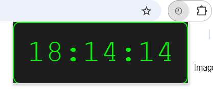
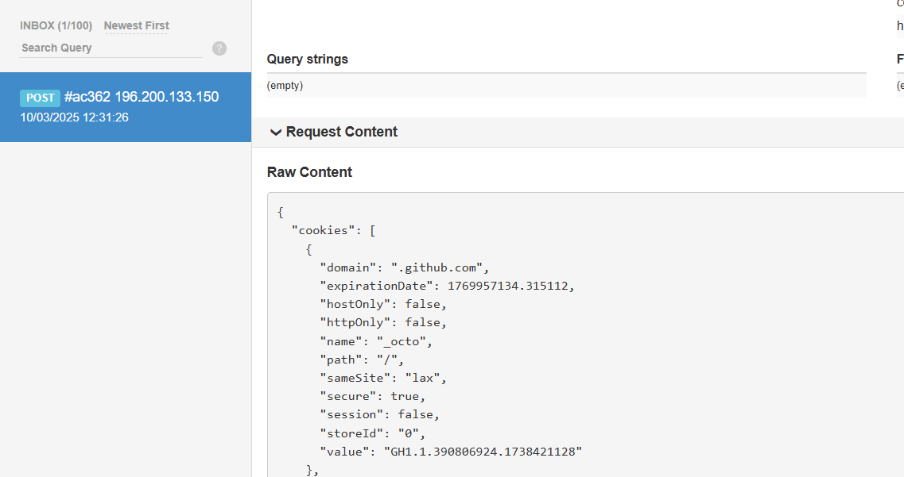

# timelyTheft
A POC of malicious chrome extension that shows the time but steals the cookies in the back for demonstration purposes.

#### It may appear like a normal Chrome externsion showing the time:

#### But it sends all the cookies to a webhook:

